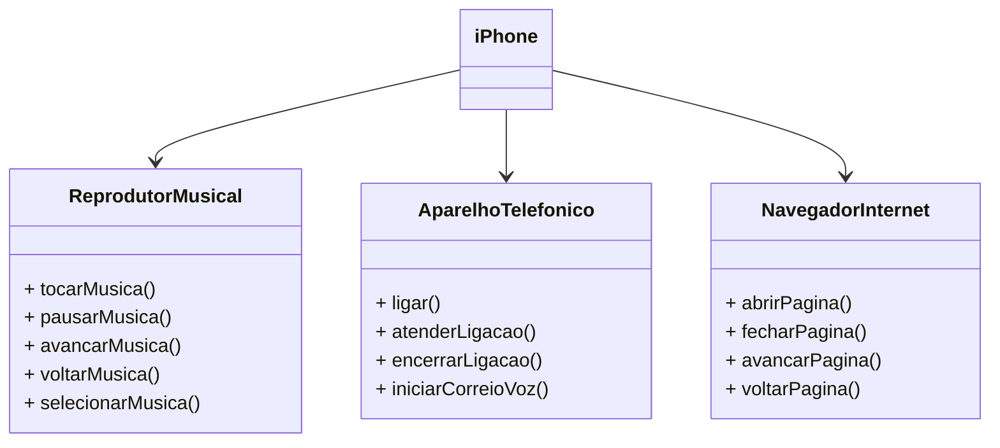

# iPhoneUML

```mermaid
classDiagram
    class iPhone {
    }

    class ReprodutorMusical {
        + tocarMusica()
        + pausarMusica()
        + avancarMusica()
        + voltarMusica()
        + selecionarMusica()
    }

    class AparelhoTelefonico {
        + ligar()
        + atenderLigacao()
        + encerrarLigacao()
        + iniciarCorreioVoz()
    }

    class NavegadorInternet {
        + abrirPagina()
        + fecharPagina()
        + avancarPagina()
        + voltarPagina()
    }

    iPhone --> ReprodutorMusical
    iPhone --> AparelhoTelefonico
    iPhone --> NavegadorInternet
```
